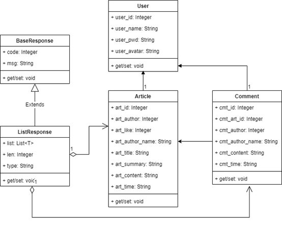
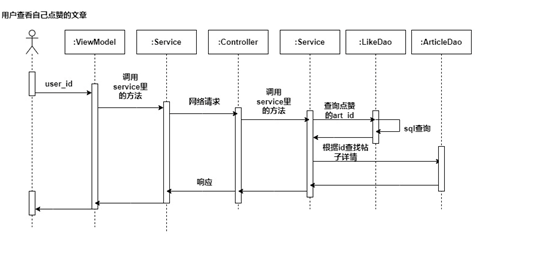
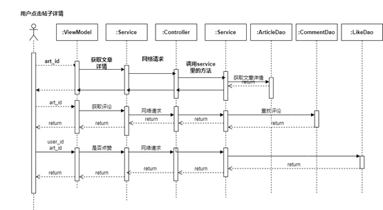
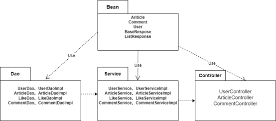
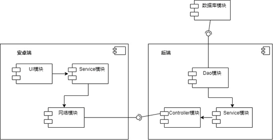

#### 1. 软件系统的编译与开发环境

***后端***

IDE：IntelliJ IDEA 2022.3.2

JDK：JDK8

Dependencies：spring-mvc 5.3.1, spring-jdbc 5.2.4, mysql-connector-java 8.0.30, druid 1.2.15

运行环境：Ubuntu18.04

MySQL：Ver 14.14 Distrib 5.7.41

编译步骤：使用IDEA打开源码，点击build -> build artifact -> demo2-war-exploaded，等待编译完成，获得war包

 

***安卓端***

IDE：Android Studio 2020.3.1

Java版本：1.8

Kotlin编译器版本：1.5.21

Compose版本：1.0.1

Dependencies：core-ktx 1.3.2, navigation-compose 2.4.1, retrofit 2.9.0, moshi 2.9.0, kotlinx-coroutines-core 1.4.3, coil-compose 1.3.2

编译步骤：使用Android Studio打开源代码，更新gradle配置文件，build

#### 2. 软件系统的安装和卸载方法

***后端***

编译完成后，将获得的war包放在tomcat/webapp目录下，然后运行tomcat/bin目录下的shutdown.sh 和 startup.sh

 

***安卓端***

编译完成后获得apk，在安卓设备上进行安装和卸载即可

#### 3. 接口设计

下面的接口以BaseURL起始

| 请求地址    | 请求方式 | 请求参数 | 返回值     | 说明                           |
| ----------- | -------- | -------- | ---------- | ------------------------------ |
| /user/{id}  | Get      | Integer  | User       | 根据ID获取用户信息             |
| /user       | Get      |          | List<User> | 获得全部用户信息               |
| /user       | Post     | User     | User       | 创建用户                       |
| /user       | Put      | User     | User       | 修改用户信息                   |
| /user/login | Post     | User     | User       | 成功返回用户信息，失败均为null |

下面的接口以BaseURL/article起始

| 请求地址            | 请求方式 | 请求参数 | 返回值                | 说明               |
| ------------------- | -------- | -------- | --------------------- | ------------------ |
| /                   | Get      |          | ListResponse<Article> | 获取全部帖子       |
| /                   | Post     | Article  | Article               | 新建帖子           |
| /user/{id}          | Get      | Integer  | ListResponse<Article> | 获取用户全部帖子   |
| /{art_id}           | Get      | Integer  | Article               | 获取帖子详情       |
| /{user_id}/{art_id} | Put      | Integer  | BaseResponse          | 用户点赞帖子       |
| /{user_id}/{art_id} | Delete   | Integer  | BaseResponse          | 用户取消点赞帖子   |
| /{user_id}/{art_id} | Get      | Integer  | BaseResponse          | 用户是否点赞帖子   |
| /like/{user_id}     | Get      | Integer  | ListResponse<Article> | 获取用户点赞的帖子 |

下面的接口以BaseURL/comment起始

| 请求地址          | 请求方式 | 请求参数 | 返回值                | 说明         |
| ----------------- | -------- | -------- | --------------------- | ------------ |
| /                 | Post     | Comment  | Comment               | 新建评论     |
| /user/{user_id}   | Get      | Integer  | ListResponse<Comment> | 获取用户评论 |
| /article/{art_id} | Get      | Integer  | ListResponse<Comment> | 获取帖子评论 |

#### 4.部分UML

##### 1. 类图

##### 2. 顺序图

查询用户点赞文章顺序图

图5 显示帖子详情顺序图

##### 3. 包图

##### 4. 组件图

#### 5. TODO

1. 接口的安全性完全没有考虑，应该加上token授权认证机制，用户密码也是以明文传输的，网络通信使用的也是http协议，安全部份没有考虑很多
2. 用户头像功能没有实现，后端这部分没有学习过，可以在以后完善
3. 和数据库的连接使用的是JdbcTemplate以后可以换成MyBatis
4. 文章列表界面后端发送的是全部文章的summary，当文章数量太多时，这样的设计肯定是不行的，应该使用分页查询